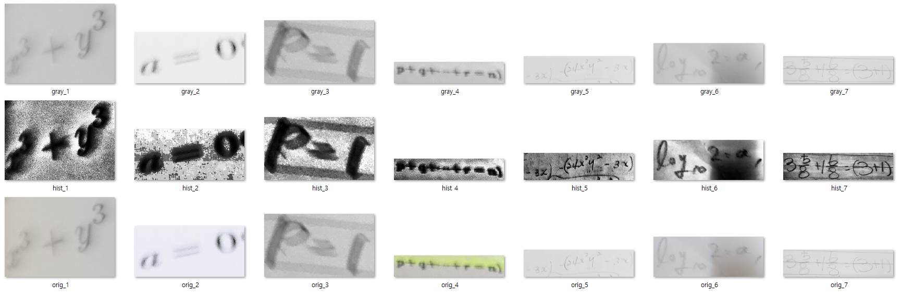

# Stage 4 - Day 07

## Opinion

adaptive histogram equalization 을 적용한 이미지를 input으로 사용하여 학습 실험을 한다.  
adaptive histogram equalization 적용 후, 기존 histogram equalization 적용

## Reason

adaptive histogram equalization 적용 후, grid 영역에 따라 편차가 있다.  
histogram equalization 을 한번 더 적용시키면 음영의 영향, 영역별 차이가 줄어드는것을 확인 할 수 있었다.  
또한 옅은 색의 문자도 0(검은색)에 근접하여 문자와 배경의 분류가 쉬워질 것으로 예상한다.

## Example

## Opinion / Offer

학습 진행
