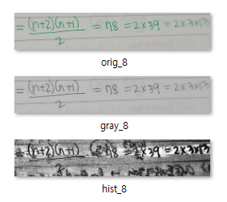
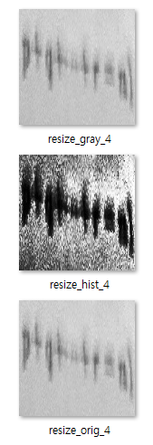

# Stage 4 - Day 08

## Opinion

histogram equalization 성능 저하 원인 분석

|           | score  | sent_acc | wer    |
| --------- | ------ | -------- | ------ |
| default   | 0.7077 | 0.6838   | 0.0776 |
| histogram | 0.6701 | 0.6437   | 0.0923 |

## Reason

1. 문자와 배경의 구분 과정에서 뒷면에서 비치는 옅은 문자까지 검은색(0)에 가깝게 만드는 문제
1. input size(128\*128) resize 로 인해 뭉개지는 영역 발생

## Example

  

## Opinion / Offer

시간은 한정되어 있으니 폐기 결정
