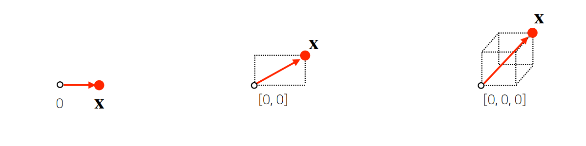
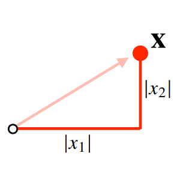
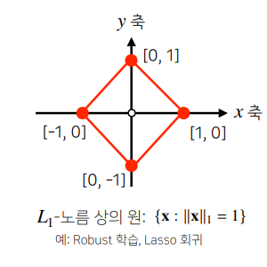
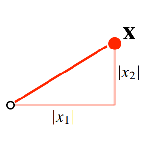
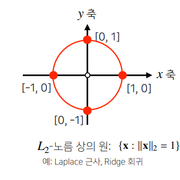
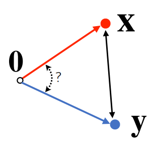
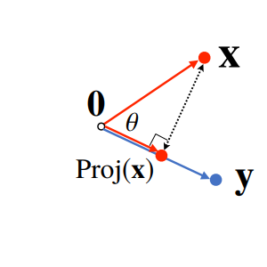
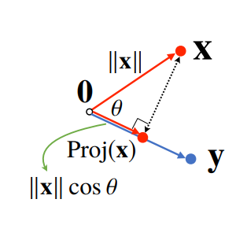
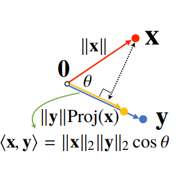

# Week 2 - Day 06 - Numpy / 벡터 / 행렬

## Introduction

### Lecture

- Week 2 Overview
- numpy
- 벡터가 뭐에요?
- 행렬이 뭐에요?

## numpy (Numerical Python)

### Creation

```python
import numpy as np

arr = np.array([1, 2, 3, 4], float)
print(arr.dtype)
print(arr.shape)
```

```python
np.arange(10)
np.arange(0, 5, 0.5)

np.zeros(shape=(10,), dtype=np.int8)
np.zeros((2, 5)))

np.ones(shape=(10,), dtype=np.int8)
np.ones((2, 5)))

np.empty(shape=(10,), dtype=np.int8)
np.empty((2, 5)))

arr = np.arange(10).reshape(2, 5)
np.ones_like(arr)

np.identity(n=3, dtype=np.int8)
np.identity(5)

np.eye(N=3, M=5, dtype=np.int8)
np.eye(3)
np.eye(3, 5, k=2)

arr = np.arange(9).reshape(3, 3)
np.diag(arr)
np.diag(arr, k=1)

# 균등분포
np.random.uniform(0, 1, 10)

# 정규분포
np.random.normal(0, 1, 10)
```

### Shape

- 0 : scalar
- 1 : vector
- 2 : matrix
- 3 : 3-tensor
- n : n-tensor

shape 는 고차원, ..., 저차원 순서

```python
tensor = [
    [[1,2,3,4],[1,2,3,4],[1,2,3,4]],
    [[1,2,3,4],[1,2,3,4],[1,2,3,4]],
    [[1,2,3,4],[1,2,3,4],[1,2,3,4]],
    [[1,2,3,4],[1,2,3,4],[1,2,3,4]],
    [[1,2,3,4],[1,2,3,4],[1,2,3,4]],
]
tensor = np.array(tensor)
print(tensor.shape)
# (5, 3, 4)
```

### Dtype

```python
np.array([1, 2, 3, 4], dtype=int)
np.array([1, 2, 3, 4], dtype=np.float64)
print(np.array([1, 2, 3, 4], dtype=np.float32).nbytes)
# 16 : 4bytes(32bits) * 4
```

### Reshape

```python
matrix = np.array([[1, 2, 3, 4], [5, 6, 7, 8]])

matrix.reshape(2, 4)
matrix.reshape(-1, 2)
matrix.flatten()
```

### Indexing

```python
arr = np.array([[1, 2, 3, 4],[5, 6, 7, 8]])
arr[0, 0] = -1
arr[0][0] = -1
```

### Slicing

```python
arr = np.array([[1, 2, 3, 4],[5, 6, 7, 8]])

arr[:, 2:]
#[[3, 4],
# [7, 8]]

arr[1, 1:3]
# [6, 7]

arr[1:3]
# [5, 6, 7, 8]
```

### Operation

```python
arr = np.arange(10)

arr = np.arange(1, 7).reshape(2, 3)
# (2, 3)
# [1, 2, 3]
# [4, 5, 6]

arr = np.array([arr for i in range(4)])
# (4, 2, 3)
# [[1, 2, 3], [4, 5, 6]]
# [[1, 2, 3], [4, 5, 6]]
# [[1, 2, 3], [4, 5, 6]]
# [[1, 2, 3], [4, 5, 6]]

arr.sum(axis=0)
# [[ 4,  8, 12],
#  [16, 20, 24]]

arr.sum(axis=1)
# [[5, 7, 9],
#  [5, 7, 9],
#  [5, 7, 9],
#  [5, 7, 9]]

arr.sum(axis=2)
# [[6, 15],
#  [6, 15],
#  [6, 15],
#  [6, 15]]

arr.mean()
arr.std()

np.exp(arr)
np.sqrt(arr)
```

```python
a = np.array([1, 2, 3])
b = np.array([4, 5, 6])
np.concatenate((a, b), axis=0)

a = np.array([1, 2, 3])
b = np.array([4, 5, 6])
np.vstack((a, b))

a = np.array([[1], [2], [3]])
b = np.array([[4], [5], [6]])
np.hstack((a, b))
```

### Element-wise Operations

```python
arr = np.arange(10).reshape(2, 5)
a + a
a - a
a * a
```

### Dot Product

```python
a = np.arange(6).reshape(2, 3)
b = np.arange(9).reshape(3, 3)
a.dot(b)
```

### Transpose

```python
arr = np.arange(10).reshape(2, 5)
arr.T
arr.transpose()
```

### Broadcasting

```python
matrix = np.arange(12).reshape(3, 4)
scalar = 3

# +, -, *, /, **, //
matrix + scalar

vector = np.arrange(3)
matrix + vector
vector = np.arrange(4)
matrix + vector
```

### %timeit

```python
# jupyter 기능
def test(x):
    return x

%timeit test(x)
```

### Comparisons

```python
arr = np.arange(10)
np.any(arr>5)
np.all(arr<0)

np.logical_and(arr>0, arr<3)

a = np.array([True, False, True], bool)
b = np.array([True, False, True], bool)
np.logical_not(a)
np.logical_or(a, b)

np.where(arr>0, 3, 2) # (condition, True, False)
np.where(arr>5)       # return index
np.isnan(arr)
np.isfinite(arr)
np.argmax(arr)
np.argmin(arr)
```

### Boolean Index, Fancy Index

```python
arr = np.arange(10)
condition = arr>5
arr[condition]

a = np.arange(10)
b = np.array([0, 0, 9, 7, 3, 1])
a[b]
a.take(b)
```

## Vector

- 공간(N차원)에서 한 점을 나타냄
- 원점으로부터 상대적 위치를 표현
- 두 벡터의 덧셈은 다른 벡터로부터 상대적 위치 이동 표현



### Norm

벡터의 원점으로부터의 거리  
임의의 차원(d)에 대해 성립  


### L1 Norm

L1 norm 은 각 성분의 변화량의 절대값  




```python
def l1_norm(x):
    x_norm = np.abs(x)
    x_norm = np.sum(x_norm)
    return x_norm
```

### L2 Norm

L2 norm 은 피타고라스 정리를 이용해 유클리드 거리 계산  




```python
def l2_norm(x):
    x_norm = x*x
    x_norm = np.sum(x_norm)
    x_norm = np.sqrt(x_norm)
    return x_norm
```

### 두 벡터 사이의 거리

두 벡터의 뺄셈을 norm  


### 두 벡터 사이의 각도



}{2{\lVert}x{\rVert}_2{\lVert}y{\rVert}_2}">

```python
def angle(x, y):
    v = np.inner(x, y) / (l2_norm(x) * l2_norm(y))
    theta = np.arccos(v)
    return theta
```

### 내적

내적은 정사영(orthogonal projection)된 벡터의 길이와 관련있다.  


Proj(x)의 길이는 코사인 법칙에 의해 가 된다.  


내적은 정사영의 길이를 벡터y의 길이  만큼 조정한 값이다.  


내적은 두 벡터의 유사도(similarity)를 측정하는데 사용 가능

=\sum_{i=1}^d{x_iy_i}">

```python
np.inner(x, y)
```

## Matrix

Vector를 원소로 가지는 2차원 배열  


### 행(row) 열(column)

특정 행(열)을 고정하면 행(열)벡터라 부른다.

### 전치행렬(Transpose Matrix)

행과 열의 인덱스가 바뀐 행렬

### 행렬 곱셈(Matrix Multiplication)


- i번쨰 행벡터와 j번쨰 열벡터 사이의 내적을 성분으로 가지는 행렬을 계산
- X의 열의 개수와 Y의 행의 개수가 같아야 한다.
- 행렬은 벡터공간에서 사용되는 연산자
- 행렬곱을 통해 벡터를 다른 차원의 공간으로 보낼수있다.
- 행렬곱을 통해 패턴을 추출할 수 있고 데이터를 압축 할수있다.

### 역행렬(Inverse Matrix)

- 행렬 의 연산을 되돌리는 행렬
- 행렬 의 역행렬 
- 항등행렬 
- 행과 열의 숫자가 같고, 행렬식(determinant)이 0이 아닌 경우에만 계산할 수 있다.

### 유사역행렬(Pseudo-Inverse), 무어-펜로즈(Moore-Penrose)역행렬


```python
Y = np.array([[0, 1], [1, -1] ,[-2, 1]])
np.linalg.pinv(Y) @ Y
```

#### 연립방정식 풀기


#### 선형회귀분석

<br>
<br>


## Team

- 지난주 과제 코드 리뷰
- 자습 공유 목표 설정
- 잡담
