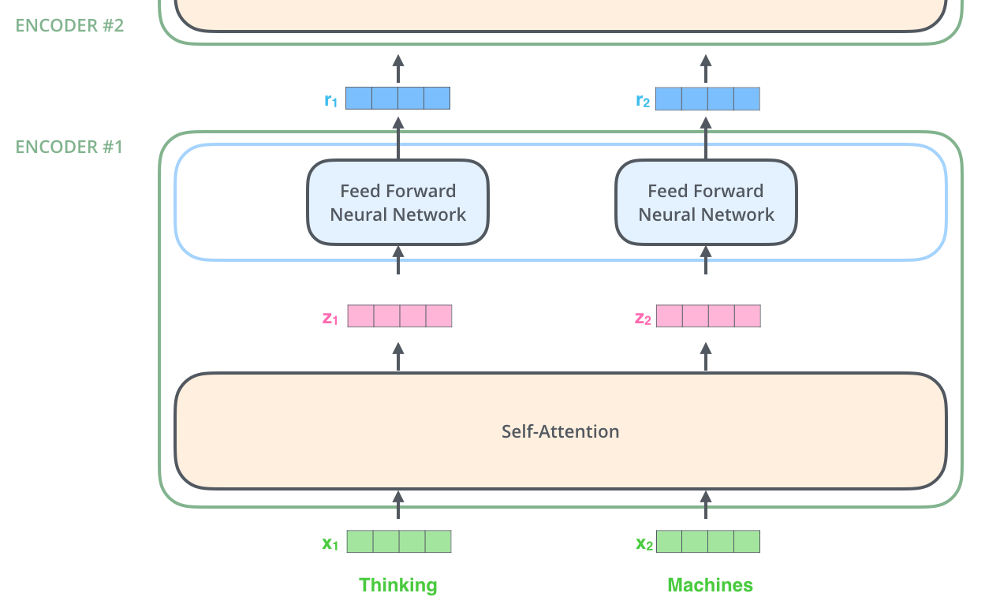

# Week 3 - Day 14 - Recurrent Neural Networks

## Introduction
### Lecture
- RNN 첫걸음
- Sequential Models - RNN
- Sequential Models - Transformer

### Reference
- [이미지 출처 - RNN](https://colah.github.io/)
- [이미지 출처 - transformer](http://jalammar.github.io/illustrated-transformer/)

## Sequence Model
### 조건부확률
이전 sequence의 정보를 가지고 앞으로 발생할 데이터의 확률분포를 다루기 위해 조건부확률을 이용한다.  

### 가변 데이터
sequence data를 다루기 위해서는 길이가 가변적인 데이터를 다룰 수 있는 모델이 필요하다.  

### Naive Sequence Model
이전 전체 데이터 고려  

### Autoregressive Model
이전 일부 데이터 고려  

### Markov Model(first-order autoregressive model)
직전 데이터만 고려  

### Latent Autoregressive Model
이전 데이터를 요약하는 hidden state 사용  

 

## Recurrent Neural Network
RNN은 short-term dependencies, 멀리 있는 과거의 정보를 고려하지 못한다는 단점이 있다.  
또한 RNN은 sequence의 길이 만큼 중첩되게 연산하는데, 이 과정에서 sigmoid의 경우 vanishing gradient, ReLU의 경우 exploding gradient이 생기는 문제가 발생한다.  
  

## Long Short Term Memory
  

### Forget Gate
input x와 previous hidden state를 기준으로 previous cell state에서 버릴 정보를 결정한다.   
  
### Input Gate
input 정보 중에 어떤 정보를 cell state에 올릴지 결정한다.  
  
### Update Cell
forget gate, input gate로 cell state를 update
  
### Output Gate
output 을 결정하는 cell state
  

## Gated Recurrent Unit
cell state가 없이 hidden state만 사용한다.  
  

## Transformer
sequence data는 순서, 길이, 구조에 제약이 적기 때문에 sequential한 modeling으로는 어려움이 있다.  
transformer는 RNN같은 재귀적인 방식이 아닌, attention이라고 부르는 구조를 사용해서 이런 문제가 없다.  

입력 sequence와 출력 sequence의 길이와 도메인은 다를 수 있다.  
transformer의 encoder는 RNN과 다르게 input sequence의 길이에 상관없이 한번에 처리한다.  
  

### Encoder
1개의 encoder 에서 self-attention, network 처리 후 다음 encoder의 입력으로 진행된다.  
  

self-attention은 n개의 input x 전체를 dependent하게 처리한다.  
반면에 feed forward 에서는 단순히 independent 하게 같은 feed forward neural network를 통과하는 것이다.  
  

### Self-Attention
self-attention은 해당 input의 다른 input과의 관계성을 알아서 학습한다. 

1. 하나의 input에 3개의 vector(Query, Key, Value)를 만든다.  
1. encoding 하려는 query vector와 전체 n개의 key vector를 내적한 score를 구한다.(=유사도)
1. score를 K의 dim의 제곱근 으로 나누어 normalize 한다.
1. softmax
1. z vector = sum(value vector * softmax)

여기서 query vector, key vector는 dim이 같아야 하지만, value vector는 달라도 된다.  

  
  
  

### Multi-Headed Attention (MHA)
attention을 여러번 사용, 하나의 input에 대해서 query, key, value를 n개 만든다.  
하나의 input에 n개의 head가 만들어 지는데, input vector와 encoding vector의 dim을 동일하게 만들어야 한다.  
  

### Positional Encoding
attention으로는 sequence 정보를 포함하지 못하기 때문에 positional encoding을 더해준다. (bias)  
  

### Decoder
encoder의 최종 key vector와 value vector를 decoder의 input으로 사용한다.  
(encoder의 key, value와 decoder의 query를 attention)  

학습 단계에서 최종 결과를 알면 의미가 없기 때문에 masking을 하고 학습한다.  

  
  
  

