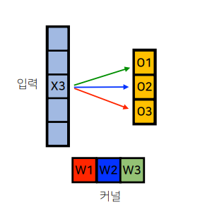
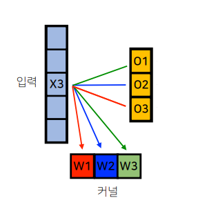
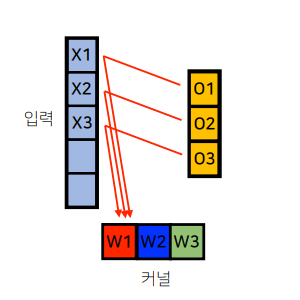

# Week 3 - Day 12 - 최적화

## Introduction
### Lecture
- Optimization
- CNN 첫걸음

## Optimization

### Generalization
- generalization gap : training error와 test error의 차이
- 일반화가 잘됨 : network의 성능이 training, test 에서 비슷하다.
- 일반화가 잘 되었다고 학습이 잘 된것은 아니다. (training error 가 높은 경우)

### Under-fitting, Over-fitting

### Cross-validation
- train data 를 K개로 나누어 하나를 validation data로 사용하는 방법
- cross-validation을 사용해 최적의 hyperparameters 를 찾고, 전체 data로 학습한다.
- 학습 과정에서는 어떤 형태로든 test data를 사용하지 않는다.

### Bias, Variance
- bias(편향)
- variance(분산)
- bias and variance tradeoff

### Bootstrapping
- training data를 subsampling하여 여러개로 사용하는 방법

### Bagging (Bootstrapping aggregating)
- Ensemble
- 독립적인 다수의 모델의 결과를 사용하는 방식 (voting or averaging)

### Boosting
- Sequential
- weak learner를 sequential 하게 결합하여 strong learner 로 만든다.
- 이전 learner의 error로 부터 학습

## Gradient Descent Methods

### Batch Size
- Stochastic gradient descent : single data
- Mini-batch gradient descent : subset data
- Batch gradient descent : whole data

### Gradient Descent

 : learning rate  
 : gradient  

### Momentum
한번 흘러가기 시작한 방향을 사용한다.  
 : accumulation  
 : momentum  

 

### Nesterov Accelerated Gradient
현재 데이터를 기반으로 한번 이동하고 그 지점의 gradient를 accumulation   
 : Lookahead gradient  

 

### Adagrad
parameters의 학습이 느리면 더빠르게, 빠르면 더 느리게 조정한다.  
분모가 계속 커져서 진행할수록 학습이 느려진다.  
 : for numerical stability  
 : Sum of gradient squares  

### Adadelta
Adagrad의 단점을 보완  
learning rate가 없다.  
 : EMA of gradient squares  
 : EMA of diffrence squares  

 

 

### RMSprop

 : EMA of gradient squares  
 : stepsize  

 

### Adam 
momentum과 EMA 개념을 결합하여 사용    
 : stepsize  
 : momentum  
 : EMA of gradient squares  

 

 

## Regularization
- test 에서도 잘 동작하도록 학습에 제한을 두는 방법  

### Early Stopping

### Parameter Norm Penalty
weight decay  

### Data Augmentation

### Noise Robustness
training에서 input data, weights에 noise를 넣으면 test 단계에서 잘 동작한다. (실험적 결과)  

### Label Smoothing
- training data 2개를 섞는 방법  
- decision boundary를 부드럽게 해준다.
- 적은 작업으로 성능이 많이 올라간다.
- Mixup : 투명도, ex)label(A=0.5, B=0.5) 
- CutMix : 일부 잘라서 붙여넣기, ex)label(A=0.6, B=0.4)
- Cutout : 일부 지우기 ex)label(A=1.0)

### Dropout

### Batch Normalization
- 적용할 layer의 parameters를 정규화
- 적용할 layer 전체 합이 0이 되도록 한다.
- 이 방식에 동의하지 않는 사람들도 많다고 한다.
- batch norm, layer norm, instance norm, group norm 등 다양한 단위의 norm 이 가능하다.

## Convolution 
### Convolution 연산
- 
- 고정된 kernel을 움직이며 사용한다.
- parameters 수가 적다.

### 수학적 이해
- convolution 연산의 수학적 의미 : 신호(signal)를 커널을 이용해 국소적으로 증폭 또는 감소 시켜서 정보를 추출 또는 필터링 하는것
- g, f : signal, kernel
- continuous : 
- discrete : 

 ### Convolution - Backpropagation
- convolution의 backpropagation도 convolution이다.  

## Team
- 강의 내용 질문 답변
- Further Questions에 대해 이야기
- kaggle study 과제 설정
